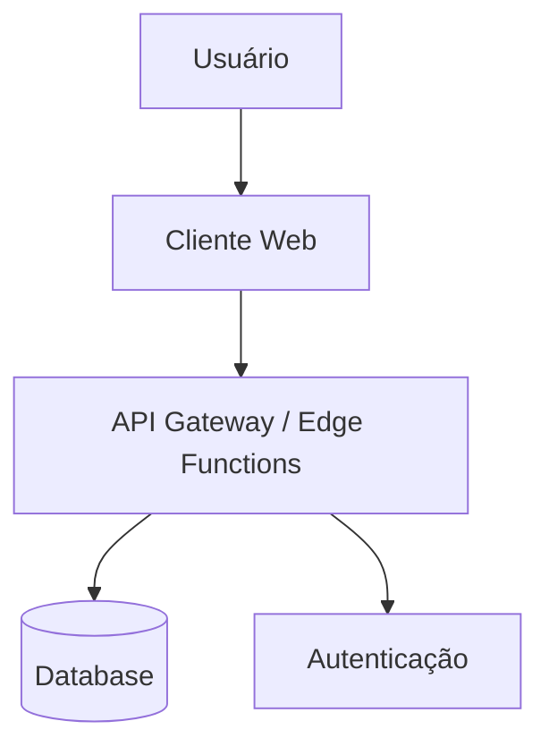

# Arquitetura Técnica - [Nome do Projeto]

## 1. Visão Geral
[Descrição de alto nível do sistema e seus objetivos técnicos]

## 2. Stack Tecnológico
- **Frontend:** [React, Vue, etc.]
- **Backend/BaaS:** [Supabase, Firebase, Node.js]
- **Database:** [PostgreSQL, MongoDB]
- **Styling:** [Tailwind, CSS Modules]
- **Deploy:** [Vercel, Netlify, AWS]

## 3. Diagrama de Arquitetura (Mermaid)

## 4. Modelo de Segurança
- **Autenticação:** [Método, providers]
- **Autorização:** [RBAC, ABAC, RLS policies]

## 5. Integrações Externas
- [Serviço 1]: [Finalidade]
- [Serviço 2]: [Finalidade]

## 6. Estratégia de Escalabilidade
[Como o sistema lidará com aumento de carga]
