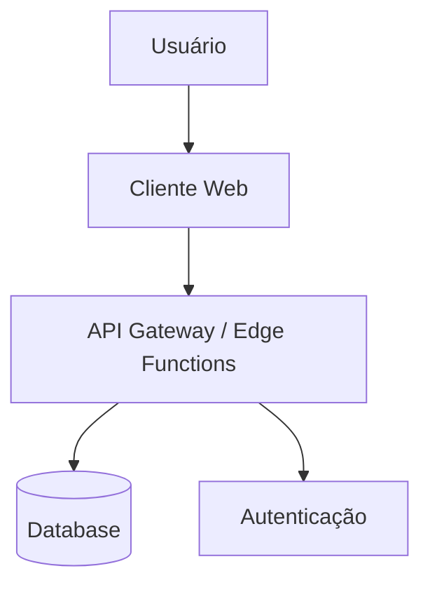

# Arquitetura Técnica - [Nome do Projeto]

## 1. Feature-Based Planning
**Mapeamento de Funcionalidades Técnicas:**
- Users should be able to: [Ação 1]
- Users should be able to: [Ação 2]

## 2. Stack Tecnológico & Princípios
- **Frontend:** [React, Vite, TypeScript]
- **Backend/BaaS:** [Supabase]
- **Styling:** [Tailwind CSS + Shadcn UI]
- **Filosofia:** [KISS, YAGNI, DRY]

## 3. Folder Structure (Feature-Based)
*Organize por FEATURE, não por TIPO.*

```text
src/
  /features/
    /[feature-name-1]/
      /components/
      /hooks/
      /services/
      /types/
    /[feature-name-2]/
      /components/
      /hooks/
  /shared/
    /components/ (General UI: Buttons, Inputs)
    /hooks/
    /lib/
```

## 4. Diagrama de Arquitetura (Mermaid)


## 4. Modelo de Segurança
- **Autenticação:** [Método, providers]
- **Autorização:** [RBAC, ABAC, RLS policies]

## 5. Integrações Externas
- [Serviço 1]: [Finalidade]
- [Serviço 2]: [Finalidade]

## 6. Estratégia de Escalabilidade
[Como o sistema lidará com aumento de carga]
