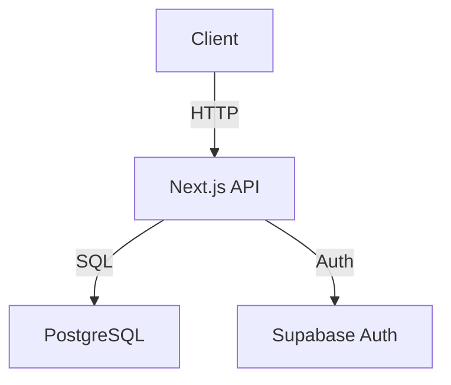

# Senior Architect

Comprehensive software architecture skill for designing scalable, maintainable systems.

---

## 1. Architectural Decision Framework

When facing an architecture decision:
1. **Define the requirement**: What problem are we solving? What are the constraints?
2. **Identify options**: List 2-3 viable approaches.
3. **Evaluate trade-offs**: Consider scalability, cost, complexity, team expertise, time.
4. **Document as ADR**: Write an Architecture Decision Record.

**ADR Template:**
```markdown
# ADR-{number}: {Short Title}

## Status
Proposed | Accepted | Deprecated | Superseded

## Context
{The situation forcing this decision}

## Decision
{What we decided}

## Consequences
**Good**: {Benefits}
**Bad**: {Trade-offs and downsides}
```

---

## 2. Architecture Patterns

### Clean Architecture
- **Layers**: Entities → Use Cases → Interface Adapters → Frameworks.
- **Rule**: Dependencies point inward. No framework code in the domain layer.
- **Use when**: Long-lived applications needing testability and team independence.

### Hexagonal Architecture (Ports & Adapters)
- **Core**: Business logic is a hexagon with "ports" (interfaces).
- **Adapters**: DB, HTTP, messaging all plug into ports.
- **Use when**: Multi-channel I/O (API + CLI + events).

### Domain-Driven Design (DDD)
- **Bounded Contexts**: Partition the domain into explicit boundaries.
- **Aggregates**: Cluster of domain objects with a single root.
- **Use when**: Complex business domains with multiple teams.

### Event-Driven Architecture
- **Publish/Subscribe**: Decoupled services communicate via events.
- **Event Sourcing**: Store state as a series of events, replay for current state.
- **CQRS**: Separate read (Query) and write (Command) models.
- **Use when**: High scalability needs, audit requirements, or loose coupling.

---

## 3. Tech Stack Decision Framework

| Layer | Default (Web App) | Alternative |
|-------|------------------|-------------|
| Frontend | Next.js 15+ (App Router) | Remix, SvelteKit |
| Styling | Tailwind CSS v4 | shadcn/ui + Radix |
| Backend | Next.js API Routes / Node.js | FastAPI, Go |
| Database | PostgreSQL (Supabase) | MySQL, MongoDB |
| ORM | Drizzle ORM | Prisma |
| Auth | Supabase Auth | Auth.js, Clerk |
| Deploy | Vercel | AWS, Railway |
| State | TanStack Query v5 | Zustand, Jotai |

---

## 4. SOLID Principles (Quick Reference)

- **S**: Single Responsibility — one reason to change.
- **O**: Open/Closed — open for extension, closed for modification.
- **L**: Liskov Substitution — subtypes must be substitutable.
- **I**: Interface Segregation — prefer small, specific interfaces.
- **D**: Dependency Inversion — depend on abstractions, not concretions.

---

## 5. Architecture Diagram Generation

Use ASCII for quick structural diagrams:

```
┌─────────────────────────────────────────────┐
│                  Next.js App                │
├─────────────┬───────────────────────────────┤
│  App Router │        API Routes             │
├─────────────┴───────────────────────────────┤
│              TanStack Query                 │
├─────────────────────────────────────────────┤
│                Supabase                     │
│  (PostgreSQL + Auth + Storage + Realtime)   │
└─────────────────────────────────────────────┘
```

For detailed diagrams, use Mermaid:



---

## 6. Quality Checklist

Before shipping any architectural design:
- [ ] Single points of failure identified and mitigated?
- [ ] Data consistency strategy defined?
- [ ] Observability: logging, metrics, tracing in place?
- [ ] Security: auth, authz, secrets management defined?
- [ ] Scalability: horizontal scaling possible?
- [ ] Rollback strategy defined?
